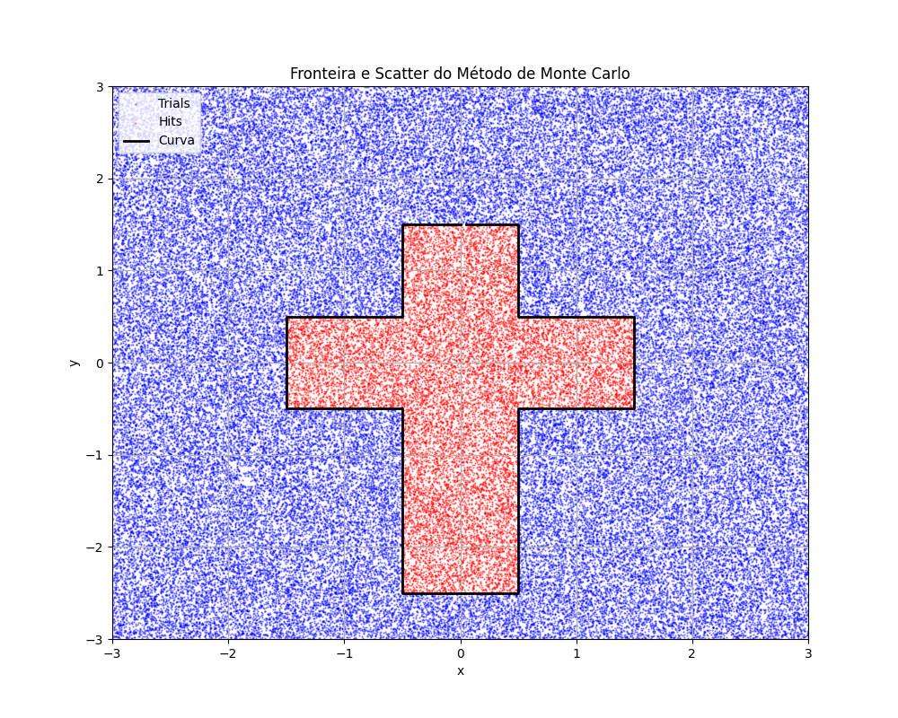

# Método de Monte Carlo

## Descrição

O programa `area` implementa o método de Monte Carlo para cálculo de área para a família das cônicas, de algumas funções e para qualquer fronteira definida a partir de um arquivo com dados `(X,Y)` gerados a partir da parametrização da fronteira (em senido horário ou anti-horário).

O módulo `rndgen` é o gerador de números KISS (keep it simple stupid) disponível no repositório [rndgen-fortran](https://github.com/wcota/rndgen-fortran/).


## Uso

O programa deve ser compilado com todos os seus módulos. Para usá-lo, a sintaxe básica está abaixo
```zsh
./executável [tamanho do sistema em x] [tamanho do sistema em y] [curva] [parâmetro a] [parâmetro b] [parâmetro c]
```
ou, para o caso da fronteira definida por um arquivo:
```zsh
./executável [tamanho do sistema em x] [tamanho do sistema em y] data_ CAMINHO_PARA_ARQUIVO
```

As funções implementadas, até agora, foram *seno*, *cosseno*, *quadrática* e *linear*.

Para plotar as cônicas, só dois parâmetros são necessários, *a* e *b*, uma vez que as cônicas podem ser escritas como:
$$\dfrac{x^2}{a^2}+\dfrac{y^2}{b^2}=1$$
para a elispe,
$$\dfrac{x^2}{a^2}-\dfrac{y^2}{b^2}=1$$
para a hipérbole, e
$$y^2=4ax$$
para a parábola.

Enquanto o tamanho do sistema, *a*, *b* e *c* aceitam qualquer número real, o parâmetro [curva] deve ser:
* `f_sin`,`f_cos`,`f_lin` ou `f_quad` para as funções;
* `elipse`, `hiperbole`, `circulo` ou `parabola` para as cônicas

O programa `gen_shape` apenas gera o formato de uma cruz e coloca numa lista de dados `data` como um exemplo para o módulo `any_shape`.



Para analisar graficamente o que o programa está fazendo, acrescente ao comando de execução:
```zsh
&& python graph.py
```

## Explicação

Os algoritmos para cônicas e funções são simples e não requerem explicação. Para conseguir aplicar o método a qualquer curva, a ideia consiste em contar quantas vezes uma curva poligonal que liga um ponto aleatório $P^r$ do plano a um ponto $P_0=(x_0,y^r)$ ($x_0$ é fixo) fora da fronteira. Se for um número ímpar, quer dizer que o ponto está no interior da fronteira, se fr um número par, quer dizer que o ponto está no exterior da fronteira.

Para implementar a ideia, basta exigir que $y_r=y_j$ para o j-ésimo item da lista de pontos (considerando a precisão limitada) e $x_j\leq x^r$ para contar se a poligonal que liga $P_0$ a $P^r$ cruza a fronteira no ponto j-ésimo da lista. Depois de percorrer toda a lista, tem-se o número de vezes que a poligonal cruza a fronteira.
